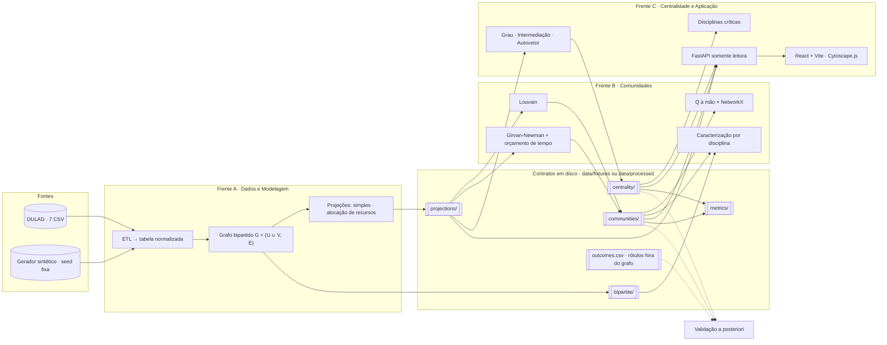

# Diagrama de componentes — figura de abertura do capítulo 3

A leitura é uma só: **as três frentes só se tocam através da coluna
central**, que é o layout de artefatos em disco (ADR-0001). Os rótulos
históricos ficam fora do grafo e entram apenas pela linha tracejada da
validação (ADR-0008).

Para o artigo, exportar em SVG:

```bash
# com a extensão Mermaid do VS Code, ou:
npx -y @mermaid-js/mermaid-cli -i docs/arquitetura/diagrama-cap3.md -o results/figures/fig1-arquitetura.svg
```



## O que cada frente produz e consome

**`[A]` Pedro** produz `bipartite/`, `projections/`, `outcomes.csv` e
`metrics/projections.csv`. Consome só CSV bruto.

**`[B]` Gabriel** produz `communities/` (partição, perfil, Q, tempo,
status) e `metrics/communities.csv`. Consome `projections/` e
`bipartite/`; lê `outcomes.csv` apenas na validação.

**`[C]` Lucas** produz `centrality/`, `metrics/centrality_top.csv`, a API
e a interface. Consome `projections/`, `communities/` e os próprios
`centrality/`.

## Legenda para o texto do artigo

- **Caixas cilíndricas** (`Fontes`): dados brutos, fora do controle do
  sistema.
- **Caixas duplas** (`Contratos em disco`): artefatos versionados por
  esquema, cada um com o `meta.json` que registra a especificação que o
  gerou.
- **Setas cheias**: fluxo de dados do pipeline.
- **Setas tracejadas**: validação a posteriori — o único caminho por onde
  um rótulo histórico entra, e ele **termina** na validação, nunca
  realimenta o pipeline.

Esse último ponto é o que o diagrama comunica melhor do que um parágrafo:
não há seta saindo de `outcomes.csv` para nenhum algoritmo.
