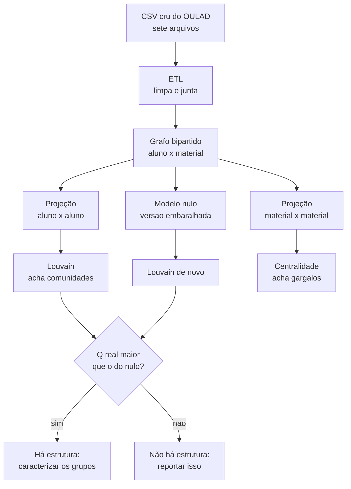

# Glossário ilustrado

Todo termo que a gente usa no projeto, explicado sem jargão e com
desenho. Se você travou numa palavra lendo um README, uma spec ou o
artigo, ela está aqui.

A ordem é de construção: cada termo usa os anteriores. Dá para ler
inteiro em uns quinze minutos, ou pular direto no que você precisa.

---

## 1. Grafo

Um grafo é só **bolinhas ligadas por riscos**. As bolinhas são os **nós**
(ou vértices). Os riscos são as **arestas**.

```
    Ana ────── Bruno
     │           │
     │           │
   Carla ───── Diego
```

Quatro nós, quatro arestas. É isso. Tudo o mais no projeto é consequência
disso.

Um grafo não tem posição: não importa se a Ana está desenhada em cima ou
embaixo. **Só importa quem está ligado a quem.**

| Termo | O que quer dizer |
|---|---|
| **nó** (vértice) | uma bolinha: um aluno, uma matéria, um material |
| **aresta** | um risco: a ligação entre duas bolinhas |
| **grau** de um nó | quantos riscos saem dele |
| **vizinhos** | os nós ligados direto a ele |

No desenho acima, todo mundo tem **grau 2**. A Ana tem dois vizinhos,
Bruno e Carla.

### Peso da aresta

Às vezes a ligação tem uma intensidade. Aí o risco carrega um número,
chamado **peso**.

```
    Ana ──(9)── Bruno        Ana e Bruno compartilham 9 coisas.
     │                       Ana e Carla compartilham só 1.
    (1)                      A ligação com Bruno é "mais forte".
     │
   Carla
```

Isso vai importar muito mais para a frente: no nosso caso, **a informação
está quase toda no peso**, não na existência do risco.

---

## 2. Grafo bipartido

"Bipartido" quer dizer **dois times**. Os nós se dividem em dois grupos, e
**as arestas só ligam um time ao outro, nunca dentro do mesmo time**.

No projeto, o time da esquerda são os alunos e o da direita é o que eles
consomem.

```
   ALUNOS              MATÉRIAS
   (time U)            (time V)

    Ana ──────────────── Cálculo
      ╲                ╱
       ╲──────────── Física
      ╱
   Bruno ───────────── Química

   Carla ───────────── Cálculo
```

Repare: **não existe risco de Ana direto para Bruno.** Aluno não liga com
aluno. Matéria não liga com matéria. Só atravessando.

Por que isso é útil? Porque é o formato natural do dado educacional. A
base não diz "Ana é parecida com Carla". Ela diz "Ana cursou Cálculo" e
"Carla cursou Cálculo". A semelhança entre Ana e Carla é algo que a gente
**vai ter que deduzir**.

> No código os dois times aparecem como `kind="student"` e
> `kind="discipline"`. O nome `discipline` marca **o lado**, não a
> natureza do nó — mesmo quando o lado direito virou "material do
> ambiente virtual", o rótulo continua `discipline`. Foi de propósito:
> mudar o rótulo quebraria o código das Frentes B e C sem ganho nenhum.

---

## 3. Projeção

Esse é o passo central do trabalho, e o nome assusta mais do que a ideia.

**Projetar é achatar o grafo bipartido num grafo de um time só.**

Se Ana e Carla cursaram a mesma matéria, a gente cria um risco direto
entre elas. A matéria some do desenho; ela vira a *justificativa* do
risco.

```
   ANTES (bipartido)              DEPOIS (projeção de alunos)

   Ana ──── Cálculo ──── Carla        Ana ───────── Carla
     ╲                                  ╲           ╱
      ╲──── Física ──── Bruno            ╲         ╱
                                          ╲       ╱
                                           Bruno
                                     (Ana-Bruno porque
                                      dividiram Física)
```

Agora sim temos aluno ligado a aluno, que é o que precisamos para
procurar grupos.

Dá para projetar para os dois lados:

| Projeção | Um risco significa |
|---|---|
| **de alunos** | esses dois alunos compartilham material |
| **de matérias** | essas duas matérias têm alunos em comum |

A projeção de alunos responde "quem estuda parecido com quem". A de
matérias responde "quais matérias são gargalo", que é a outra metade do
objetivo do trabalho.

### As duas formas de calcular o peso

Aqui há uma escolha, e ela acabou virando um dos achados do trabalho.

**Contagem simples.** O peso é quantas coisas os dois compartilham.

```
   Ana e Carla dividiram 3 materiais  →  peso 3
   Ana e Bruno dividiram 1 material   →  peso 1
```

Simples, mas tem um defeito sério: quem acessa muita coisa acaba com peso
alto com **todo mundo**. O peso passa a medir o quanto a pessoa é ativa,
não o quanto as duas se parecem.

**Alocação de recursos** (Zhou et al., 2007). Cada material distribui uma
quantidade fixa de "água" entre quem o acessou, então **material
disputado por muita gente vale menos**.

```
   Material que só 2 alunos usaram   →  vale muito (é específico)
   Material que 500 alunos usaram    →  vale pouco (todo mundo usa)
```

É a mesma intuição de "ter um hobby raro em comum diz mais sobre vocês do
que os dois respirarem".

> **Achado do projeto.** As duas dão resultados diferentes, e a diferença
> importa. Quando filtramos só as ligações mais fortes, a contagem
> simples passou a apontar estrutura *pior que o acaso*, enquanto a
> alocação de recursos continuou apontando estrutura real. Motivo: as
> ligações mais pesadas na contagem simples eram só "os alunos mais
> ativos entre si".

---

## 4. Granularidade

Granularidade é **o quão fino é o nó do lado direito**.

A mesma base pode virar grafos bem diferentes dependendo do que a gente
decide chamar de "uma coisa" no time V.

```
GROSSO                                                      FINO
─────────────────────────────────────────────────────────────>

  matéria        matéria+turma      avaliação      material do AVA
  ("Cálculo")    ("Cálculo 2013")   ("Prova 1")    ("vídeo da aula 3")

  7 nós          22 nós             ~200 nós       6.364 nós
```

Por que isso é decisivo? Porque define quantos vizinhos cada aluno tem.

| Granularidade | Quantas coisas o aluno médio tem |
|---|---|
| matéria | **1** |
| matéria + turma | **1** |
| avaliação | 10, mas todo mundo faz as mesmas |
| **material do ambiente virtual** | **40** |

Com **1**, não dá para fazer nada. Um aluno ligado a uma única matéria
não tem como ser comparado com ninguém de forma interessante — ele fica
ligado a todos os colegas daquela matéria, com peso 1, e a ninguém mais.

```
   GRANULARIDADE GROSSA (grau 1)      GRANULARIDADE FINA (grau 40)

   Todos de Cálculo:                  Cada aluno tem um conjunto
   um bolo indistinguível             próprio de materiais

      ●───●───●                          ●──────●
      │ ╳ │ ╳ │                          │╲    ╱│
      ●───●───●                          │ ╲  ╱ │
                                         │  ╳╱  │
   Todos iguais a todos.                 ●──────●
   Não há grupo a achar.
                                      Dá para distinguir perfis.
```

> No código isso é o campo `granularity`. Os valores possíveis são
> `module`, `module_presentation`, `assessment`, `vle_site` e
> `vle_activity_type`. Os três primeiros usam **matrícula**; os dois
> últimos usam **comportamento**.

---

## 5. Critério de aresta

Se granularidade é *o que* é o nó, critério de aresta é **o que faz o
risco existir**.

Cursar a matéria já basta? Precisa ter passado? Precisa ter nota acima de
40? Precisa ter clicado no material?

| Critério | O risco existe quando |
|---|---|
| `score_threshold` | a nota passou de um valor |
| `final_result_pass` | o aluno foi aprovado |
| `vle_activity` | o aluno interagiu com o material |

Essa escolha muda completamente o grafo, e foi ela que a gente acabou
trocando no meio do projeto.

---

## 6. AVA (ambiente virtual de aprendizagem)

É o "Moodle" da base: a plataforma onde o aluno abre vídeo, lê texto,
entra no fórum, faz questionário. A base registra **cada clique**.

São 6.364 materiais em 20 tipos de atividade. Foi aí que encontramos a
informação que faltava — porque um aluno interage com dezenas de
materiais, mesmo cursando uma matéria só.

---

## 7. Comunidade e modularidade

**Comunidade** é um grupo de nós que se ligam muito entre si e pouco com
o resto. É o que estamos procurando.

```
    ●───●           ●───●
    │ ╲ │           │ ╲ │
    ●───●───────────●───●
                ↑
       grupo A   │   grupo B
            uma ligação só
              entre eles
```

Dois grupos bem separados. Ninguém precisa de algoritmo para ver isso num
desenho de 8 nós — mas com 1.870 alunos e 1,7 milhão de ligações, precisa.

**Modularidade** (o tal do **Q**) é uma nota de 0 a 1 que diz **o quanto
uma divisão em grupos é boa**. Quanto mais as ligações ficam dentro dos
grupos e menos atravessam, maior o Q.

```
   Q alto  →  ●─●─●      ●─●─●     grupos densos, pouca ponte
                  └────────┘

   Q baixo →  ●─●─●─●─●─●─●        tudo ligado com tudo,
              ╲_╱ ╲_╱ ╲_╱          divisão não significa nada
```

**Louvain** e **Girvan-Newman** são dois algoritmos que tentam achar a
divisão de maior Q. Não são IA: não têm treino, não têm exemplo rotulado,
não aprendem nada. São contas fechadas sobre a estrutura do grafo.

---

## 8. Modelo nulo — a ideia mais importante do projeto

Esta é a parte que vale a pena entender de verdade, porque foi ela que
salvou o trabalho de concluir o contrário do certo.

**O problema:** a modularidade sempre acha alguma coisa. Mesmo num grafo
totalmente aleatório, o algoritmo devolve grupos e um Q até alto. Um Q de
0,77 parece ótimo, mas sozinho não prova nada.

**A solução:** embaralhar e comparar.

```
   GRAFO REAL                    RÉPLICAS EMBARALHADAS
   (quem acessou o quê)          (mesmos números, ligações sorteadas)

      Ana ── vídeo 1                Ana ── fórum 7
      Ana ── vídeo 2                Ana ── vídeo 5
    Bruno ── vídeo 1              Bruno ── texto 3

        ↓ rodar Louvain               ↓ rodar Louvain

        Q = 0,77                      Q = 0,78
                    ╲            ╱
                     ╲          ╱
              O real NÃO é melhor que o acaso.
              Então o 0,77 não significa nada.
```

As réplicas mantêm tudo igual: mesma quantidade de alunos, mesma
quantidade de ligações, cada aluno com o mesmo número de ligações que
tinha. **Só quem-se-liga-com-quem é sorteado.** Toda estrutura real é
destruída de propósito.

Se o Q real não for maior que o das réplicas, não há estrutura a
reportar. Foi exatamente o que aconteceu com a modelagem por matéria, e é
por isso que trocamos para o AVA.

| Base | Q real | Q embaralhado | Leitura |
|---|---|---|---|
| sintética (grupos plantados) | 0,4666 | 0,2079 | tem estrutura |
| OULAD por matéria | 0,7728 | 0,7810 | **não tem** |
| OULAD pelo AVA | 0,0825 | 0,0158 | tem estrutura |

Repare no detalhe que engana: o Q de **0,77** não vale nada e o de
**0,08** vale. O número sozinho não diz nada — **só a comparação diz**.

---

## 9. Centralidade

Centralidade responde **quais nós são importantes**. Há três formas, e
cada uma define "importante" de um jeito.

**Grau.** Importante = tem muitos vizinhos. É a contagem crua.

```
      ●
      │
  ●───●───●     o nó do meio tem grau 4
      │
      ●
```

**Intermediação** (betweenness). Importante = está no caminho dos outros.
É o gargalo, a ponte.

```
   ●───●           ●───●
   │ ╲ │           │ ╲ │
   ●───●─── X ─────●───●

   X tem grau baixo, mas TODO caminho de um lado
   para o outro passa por ele. Tirando X, o grafo
   se parte em dois. Intermediação altíssima.
```

No contexto educacional, é o candidato natural a "matéria gargalo".

**Autovetor** (eigenvector). Importante = está ligado a quem é
importante. É recursivo, e é a mesma ideia do PageRank do Google.

```
   Estar ligado a 10 nós irrelevantes  <  estar ligado a 2 nós centrais
```

---

## 10. Termos do dia a dia do repositório

| Termo | O que é |
|---|---|
| **coorte** | um recorte de turma, tipo "matéria BBB, entrada de 2013". Usamos porque a base inteira não cabe na memória |
| **densidade** | fração dos riscos possíveis que existem de fato. 1,0 = todo mundo ligado com todo mundo |
| **grafo completo** | densidade 1,0. Ruim para nós: se todos estão ligados a todos, não há grupo a distinguir |
| **esparso** | poucos riscos. O oposto de denso |
| **componente** | pedaço do grafo que não se conecta ao resto |
| **extração de espinha** | jogar fora as ligações fracas e ficar só com as fortes. Ajuda a enxergar, mas quebra o grafo em pedaços se exagerar |
| **artefato** | arquivo de resultado gravado em disco (`nodes.csv`, `edges.csv`, `meta.json`). É como as frentes conversam |
| **contrato** | o formato acordado desses arquivos. Está congelado: mudar exige ADR e aval dos três |
| **ADR** | registro curto de uma decisão de arquitetura e do porquê dela |
| **spec** | o documento de uma tarefa: objetivo, escopo, critérios de aceite |
| **frente** | a divisão do trabalho entre os três. A é dados, B é comunidades, C é centralidade |
| **fixture** | base pequena e fixa usada nos testes. Nunca muda |
| **seed** | número que faz o sorteio dar sempre o mesmo resultado. Todo algoritmo com aleatoriedade recebe uma |
| **ETL** | o processo de ler os arquivos crus, limpar e juntar numa tabela usável |
| **OULAD** | a base que usamos, da Open University. 29.278 matrículas de 26.099 alunos |

---

## 11. O caminho inteiro, de ponta a ponta



A Frente A entrega até as projeções e o modelo nulo. A Frente B pega dali
para a esquerda do losango, a Frente C pega a centralidade.

---

## 12. O que este trabalho não faz, e por quê

Não usamos **nenhuma** técnica de aprendizado de máquina. Nada de
`sklearn`, nada de rede neural, nada de k-means, nada de classificador.

Não é limitação técnica, é a proposta. O trabalho mostra que dá para
achar agrupamentos interpretáveis **só com Teoria dos Grafos**, sem
treinar modelo nenhum e sem usar rótulo nenhum como entrada.

Por isso as notas e o resultado final da matrícula ficam guardados num
arquivo separado, longe do grafo. Eles só entram **depois**, para
conferir se os grupos que a topologia achou têm alguma relação com o
desempenho. Se entrassem antes, a conclusão seria circular.

> Há um teste automático que quebra a build se alguém importar uma
> biblioteca de aprendizado de máquina, e outro que quebra se alguém ler
> o arquivo de notas de um lugar não autorizado. A regra é verificada,
> não confiada.
