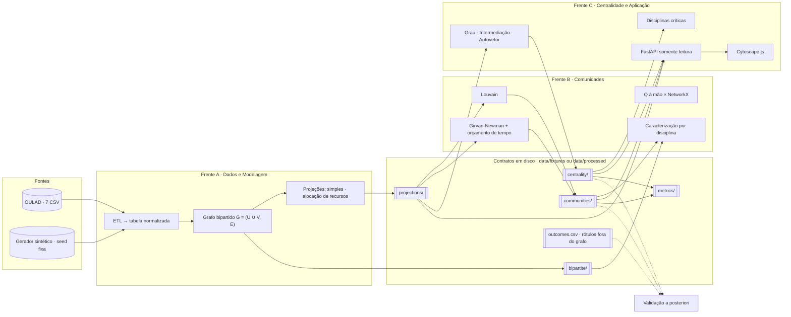

# Arquitetura das Três Frentes — Plano de Implementação

**TCC Grupo 16 · UniAnchieta · Documento para revisão do grupo**

| | |
|---|---|
| **Estado** | **aprovado e executado** — o repositório é a realização deste plano (17 de setembro de 2026) |
| **Data** | 16 de setembro de 2026 |
| **Base** | `docs/briefing.md` + starter kit em `reference/starter-kit/` |
| **Ambiente conferido** | Python 3.14.7, networkx 3.6.1, pandas 3.0.2, numpy 2.4.4, python-louvain 0.16, fastapi 0.141.1 |
| **Ambiente de execução** | Python 3.13.15 com as mesmas versões de biblioteca; `requires-python >= 3.11` |
| **Versão em página** | https://claude.ai/artifact/B4AZgJzNvsTkXwYaGrcqet |

> **Nota de estado.** Este documento é mantido como **registro do plano
> aprovado**, não como descrição do estado atual. Onde a execução divergiu,
> há uma nota marcada com ▸. O estado atual está em
> [`arquitetura/visao-geral.md`](arquitetura/visao-geral.md), e as decisões
> em [`adr/`](adr/README.md).
>
> **As quatro decisões da seção 11 foram resolvidas** (detalhe na própria
> seção): D1, D2 e D4 conforme a recomendação; **D3 divergiu** — o grupo
> escolheu React + Vite, registrado na ADR-0005.

**Legenda de donos:** `[A]` Pedro — dados e modelagem · `[B]` Gabriel — comunidades · `[C]` Lucas — centralidade, API e front-end · `[T]` transversal, gerado no dia 0 e congelado depois.

---

## Sumário

1. [O plano em uma tela](#1-o-plano-em-uma-tela)
2. [Componentes e fronteiras](#2-componentes-e-fronteiras)
3. [Estrutura de diretórios](#3-estrutura-de-diretórios)
4. [Contratos entre camadas](#4-contratos-entre-camadas)
5. [Como cada frente trabalha sem bloquear as outras](#5-como-cada-frente-trabalha-sem-bloquear-as-outras)
6. [Estratégia de testes](#6-estratégia-de-testes)
7. [Branches e merge](#7-branches-e-merge)
8. [Ordem de entrega](#8-ordem-de-entrega)
9. [Specs por frente](#9-specs-por-frente)
10. [ADRs propostas](#10-adrs-propostas)
11. [Decisões que precisam do grupo](#11-decisões-que-precisam-do-grupo)
12. [Riscos e mitigações](#12-riscos-e-mitigações)
13. [O que será gerado após a aprovação](#13-o-que-será-gerado-após-a-aprovação)

---

## 1. O plano em uma tela

O starter kit prova que o pipeline fecha, mas amarra as frentes por importação direta e por caminhos fixos: a API importa comunidade e centralidade, e cada script pressupõe que o anterior rodou. A arquitetura proposta troca essa amarração por seis decisões:

1. **A fronteira entre frentes é o disco.** Nenhuma frente importa outra. Cada uma lê e escreve artefatos num layout fixo, validado por código, e um teste automatizado falha se aparecer um import cruzado.
2. **Contratos primeiro e congelados.** O pacote `edugraph.contracts` (tipos, leitura/escrita, validadores, protocolos) entra em `main` no dia 0. Mudança nele exige ADR e aprovação dos três.
3. **Fixtures versionadas e completas.** `data/fixtures/synthetic_v1` já traz o bipartido, as quatro projeções, partições e centralidades de referência. B e C rodam, testam e até sobem a API sem executar uma linha da Frente A.
4. **Trocar de fonte, não de código.** Todo comando e todo teste aceita `--root`. Quando as projeções do OULAD existirem em `data/processed`, B e C mudam só o argumento.
5. **API somente leitura sobre artefatos pré-computados.** O cálculo acontece pela CLI (`python -m edugraph run configs/x.toml`). Girvan-Newman não roda por requisição HTTP.
6. **Tudo o que o artigo compara é parâmetro.** Granularidade do nó disciplina, critério de aresta, ponderação, algoritmo e orçamento de tempo vivem em um arquivo TOML por configuração. Cada configuração vira uma linha das tabelas do capítulo 3.

---

## 2. Componentes e fronteiras

Esta é a figura que abre o capítulo 3. No repositório ela será entregue em Mermaid (editável) e em SVG (para o artigo). A leitura é: as três frentes só se tocam através da coluna central, que é o layout de artefatos em disco. Os rótulos históricos ficam fora do grafo e entram apenas pela linha tracejada da validação.



**`[A]` produz** `bipartite/` e `projections/`, mais `outcomes.csv` e `metrics/projections.csv` (manual × NetworkX). Consome só CSV bruto.

**`[B]` produz** `communities/` (partição, perfil, Q, tempo, status) e `metrics/communities.csv`. Consome `projections/` e `bipartite/`; lê `outcomes.csv` só na validação.

**`[C]` produz** `centrality/`, `metrics/centrality_top.csv`, a API e a página de visualização. Consome `projections/`, `communities/` e os próprios `centrality/`.

---

## 3. Estrutura de diretórios

Um pacote instalável (`src/edugraph`) com um subpacote por frente e um subpacote de contratos que ninguém edita sozinho. Cada frente toca essencialmente três pastas: a sua em `src/`, a sua em `tests/` e a sua em `docs/specs/`. A etiqueta à direita diz quem é o dono.

```
TCC.bipartite-network-analysis/
├── README.md                      # onboarding: clonar → instalar → rodar tudo sobre fixtures
├── CLAUDE.md                      # regras do repositório: fronteiras, sem ML, contratos, comandos
├── pyproject.toml                 # pacote edugraph · ruff · mypy · pytest
├── requirements.txt               # versões do starter kit + scipy, matplotlib
├── requirements-dev.txt           # pytest, ruff, mypy, httpx
├── .gitignore                     # data/raw, data/interim, data/processed, __pycache__, .venv
├── .github/workflows/ci.yml       # ruff + mypy (contracts) + pytest -m "not slow"
├── configs/                       # um TOML por configuração de experimento
│   ├── synthetic_v1.toml
│   ├── oulad_module_presentation.toml
│   └── oulad_cohort_bbb_2013j.toml
├── data/
│   ├── fixtures/                  [T] commitado · imutável · nova versão = nova pasta
│   │   ├── tiny_v1/               #   6 alunos × 3 disciplinas, valores conferíveis à mão
│   │   └── synthetic_v1/          #   120 alunos, 7 disciplinas, 3 grupos plantados (seed 42)
│   ├── raw/oulad/                 [A] ignorado · 7 CSV baixados por script, com checksum
│   ├── interim/                   [A] ignorado · tabelas normalizadas em cache
│   └── processed/                 [A][B][C] ignorado · saídas reais, mesmo layout das fixtures
├── docs/
│   ├── README.md                  # índice da pasta
│   ├── briefing.md                # o BRIEFING.md, movido da raiz
│   ├── plano-arquitetura.md       # este documento
│   ├── adr/                       # ADR-0001 … ADR-0011 + template
│   ├── contratos/                 # um .md por contrato, espelhando contracts/
│   ├── arquitetura/               # visão geral · diagrama do cap. 3 (mermaid + svg) · paralelismo
│   ├── specs/                     # README (quadro) · frente-a/ · frente-b/ · frente-c/
│   ├── testes/estrategia.md
│   └── artigo/                    # decisões metodológicas · índice de figuras · índice de tabelas
├── reference/starter-kit/         # prova de conceito, citada nos ADRs (sem __pycache__)
├── results/                       [A][B][C] tabelas e figuras finais do artigo, commitadas
│   ├── tables/
│   └── figures/
├── scripts/
│   ├── make_fixtures.py           [T] regenera fixtures; só cria versão nova, nunca sobrescreve
│   └── download_oulad.py          [A]
├── src/edugraph/
│   ├── __main__.py                [T] raiz de composição: monta os 3 grupos de CLI e o comando run
│   ├── contracts/                 [T] CONGELADO após o dia 0 · mudança = ADR + aprovação dos três
│   │   ├── types.py               #   dataclasses, Literals, ids
│   │   ├── protocols.py           #   ProjectionAlgorithm · CommunityAlgorithm · CentralityMetric
│   │   ├── io.py                  #   load_* / save_* dos bundles (CSV + meta.json)
│   │   ├── validate.py            #   invariantes → ContractError
│   │   ├── paths.py               #   resolução <root>/<dataset>/<camada>/<id>
│   │   └── registry.py            #   registro de algoritmos e estágios por nome
│   ├── data/                      [A]
│   │   ├── synthetic.py           #   gerador (porta do starter kit) + ground truth
│   │   ├── oulad/                 #   download.py · schema.py · etl.py
│   │   ├── bipartite.py           #   build_bipartite(table, BipartiteSpec)
│   │   ├── projection/            #   manual.py (simples + RA) · networkx_ref.py · compare.py
│   │   ├── report.py              #   estatísticas e figuras da frente
│   │   └── cli.py
│   ├── community/                 [B]
│   │   ├── louvain.py · girvan_newman.py · modularity.py
│   │   ├── characterize.py · compare.py · evaluate.py
│   │   └── report.py · cli.py
│   ├── centrality/                [C]
│   │   ├── degree.py · betweenness.py · eigenvector.py
│   │   ├── critical_disciplines.py · disagreement.py · evaluate.py
│   │   └── report.py · cli.py
│   ├── api/                       [C]
│   │   └── app.py · routes.py · schemas.py · static/index.html (Cytoscape.js)
│   └── reporting/                 [T] escrita de tabelas, estilo de figuras, índice gerado
└── tests/
    ├── conftest.py                # opção --artifacts-root · loaders de fixture
    ├── contract/                  [T] validadores sobre todo dataset do root · round-trip ·
    │                              #   fronteiras de import · rótulos fora do grafo
    ├── data/                      [A] inclui tests/data/oulad_mini/ com o esquema real das 7 tabelas
    ├── community/                 [B]
    ├── centrality/                [C]
    └── api/                       [C]
```

O nome do pacote (`edugraph`) e o idioma dos identificadores são a decisão **D2** da seção 11.

---

## 4. Contratos entre camadas

Um contrato aqui tem três partes, e as três são verificáveis por ferramenta: o tipo Python (dataclass ou Protocol, checado por mypy), o layout em disco (CSV + `meta.json`, lido e escrito só por `contracts.io`) e o validador (`contracts.validate`, executado pelos testes de contrato sobre cada artefato). Quem programa contra o contrato nunca vê a implementação da frente vizinha.

São cinco contratos de dados e um de rótulos. Os nomes dos campos abaixo são os que irão para o código.

| Contrato | Produz | Consome | Responde a |
|---|---|---|---|
| `BipartiteBundle` | `[A]` | `[B]` caracterização · `[C]` API | seção 6.1, passo 2 do briefing |
| `ProjectionBundle` | `[A]` | `[B]` · `[C]` | projeção aluno↔aluno e disciplina↔disciplina, duas ponderações |
| `Partition` | `[B]` | `[C]` API e front | agrupamentos interpretáveis; Q, k e tempo por algoritmo |
| `CentralityResult` | `[C]` | `[C]` API e front | disciplinas críticas; rankings de centralidade |
| `metrics/*.csv` | todos | artigo | métricas exportáveis em formato tabelável |
| `Outcomes` | `[A]` | `[B]` · `[C]` só em `evaluate.py` | validação a posteriori; materializa a restrição da seção 2 |

### 4.1 Tipos

```python
# src/edugraph/contracts/types.py (trecho)
SCHEMA_VERSION = "1.0"

NodeKind = Literal["student", "discipline"]
Weighting = Literal["simple", "resource_allocation"]
Granularity = Literal["module", "module_presentation", "assessment"]
EdgeCriterion = Literal["score_threshold", "final_result_pass", "vle_activity"]


@dataclass(frozen=True)
class BipartiteSpec:  # o que o grupo vai variar e comparar no cap. 3
    dataset: str  # "synthetic_v1", "oulad_bbb_2013j"
    granularity: Granularity  # o que é um nó "disciplina"
    edge_criterion: EdgeCriterion  # o que cria uma aresta aluno-disciplina
    threshold: float | None = None  # nota mínima, cliques mínimos…
    cohort: str | None = None  # subgrafo por apresentação (estratégia de escala)
    seed: int | None = None  # só para dados sintéticos


@dataclass(frozen=True)
class ProjectionSpec:
    side: NodeKind
    weighting: Weighting
    implementation: Literal["manual", "networkx"] = "manual"
    projection_id: str  # derivado: "student_resource_allocation"


@dataclass
class BipartiteBundle:  # nós str com attr kind; arestas com weight
    graph: nx.Graph
    spec: BipartiteSpec
    meta: Meta  # schema_version, producer, created_at, stats


@dataclass
class ProjectionBundle:  # grafo simples, sem laços, weight > 0, um só kind
    graph: nx.Graph
    spec: ProjectionSpec
    source: BipartiteSpec
    meta: Meta


@dataclass
class Partition:  # saída da Frente B
    algorithm: Literal["louvain", "girvan_newman"]
    projection_id: str
    membership: dict[str, int]  # nó → comunidade, ids densos 0..k-1
    modularity: float
    n_communities: int
    runtime_s: float
    params: dict[str, Any]  # seed, resolution, time_budget_s, sample…
    status: Literal["ok", "timeout", "skipped"]
    meta: Meta


@dataclass
class CentralityResult:  # saída da Frente C, uma por métrica
    projection_id: str
    metric: Literal["degree", "betweenness", "eigenvector"]
    scores: dict[str, float]
    params: dict[str, Any]  # normalized, weight, max_iter, tol, implementation
    runtime_s: float
    converged: bool
    meta: Meta


@dataclass
class Outcomes:  # rótulos históricos: NUNCA entram no grafo
    final_result: dict[str, str]  # aluno → Pass / Fail / Withdrawn / Distinction
    planted_group: dict[str, int] | None  # só sintético: ground truth
```

### 4.2 Protocolos

Cada frente registra suas implementações contra estas interfaces. O runner genérico e a API conhecem apenas os protocolos, nunca os módulos concretos.

```python
# src/edugraph/contracts/protocols.py
class ProjectionAlgorithm(Protocol):
    name: str

    def project(self, bipartite: BipartiteBundle, spec: ProjectionSpec) -> ProjectionBundle: ...


class CommunityAlgorithm(Protocol):
    name: str

    def run(self, projection: ProjectionBundle, **params: Any) -> Partition: ...


class CentralityMetric(Protocol):
    name: str

    def compute(self, projection: ProjectionBundle, **params: Any) -> CentralityResult: ...


class Stage(Protocol):  # o comando `run` só conhece isto
    name: str  # "data" | "community" | "centrality"

    def run(self, roots: list[Path], out: Path, config: RunConfig) -> list[Path]: ...
```

### 4.3 Layout em disco

O mesmo layout vale para `data/fixtures` e `data/processed`. Trocar de fonte é trocar a raiz.

```
<root>/<dataset>/                       # root = data/fixtures | data/processed
├── bipartite/
│   ├── nodes.csv          # id,kind,label      (nunca contém rótulos de desfecho)
│   ├── edges.csv          # source,target,weight
│   ├── outcomes.csv       # student_id,final_result[,planted_group]   <- só validação
│   └── meta.json          # schema_version,kind,spec,stats,producer,created_at
├── projections/<projection_id>/        # student_simple · student_resource_allocation ·
│   ├── nodes.csv                       # discipline_simple · discipline_resource_allocation
│   ├── edges.csv
│   └── meta.json
├── communities/<algorithm>__<projection_id>/
│   ├── membership.csv     # node_id,community
│   ├── profile.csv        # community,size,top_disciplines,…   (spec B-05)
│   └── meta.json          # modularity,n_communities,runtime_s,status,params
├── centrality/<projection_id>/
│   ├── degree.csv · betweenness.csv · eigenvector.csv     # node_id,score
│   └── <metric>.meta.json
└── metrics/
    ├── communities.csv    # dataset,projection_id,algorithm,Q,n_communities,runtime_s,status
    ├── centrality_top.csv # dataset,projection_id,metric,rank,node_id,score
    └── projections.csv    # manual × networkx: igualdade máxima, tempo, n_edges
```

### 4.4 Invariantes que o validador checa

- **Bipartido:** todo nó tem `kind`; toda aresta liga `student` a `discipline`; ids únicos com prefixo `S`/`D` coerente com o kind.
- **Projeção:** sem laços, sem multiarestas, `weight` finito e positivo; todos os nós do mesmo kind, igual a `spec.side`.
- **Partição:** chaves de `membership` iguais ao conjunto de nós da projeção; ids de comunidade densos `0..k-1`; `n_communities == k`; Q em [−0,5, 1].
- **Centralidade:** chaves iguais ao conjunto de nós; valores finitos; grau e intermediação em [0, 1] quando normalizados; autovetor não negativo.
- **Rótulos:** `nodes.csv` nunca contém coluna de desfecho, nota ou atributo demográfico (lista proibida no validador).
- **Escrita canônica:** nós e arestas ordenados, para que fixtures e diffs sejam determinísticos.

### 4.5 Por que CSV + meta.json, e não GML

O starter kit salva GML: 10.577 linhas para 120 nós e 1.971 arestas, com tipos inferidos na leitura. Uma lista de arestas em CSV tem uma linha por aresta, abre no pandas, no Excel e no front-end, e o `meta.json` carrega a especificação que gerou o artefato, que é o que o artigo precisa citar. Exportar GML ou GraphML para o Gephi continua disponível como conveniência, não como contrato. Registrado na ADR-0002.

Formato do `meta.json` e nomes de coluna são parte do contrato e têm `schema_version`: mudar exige nova versão e ADR.

---

## 5. Como cada frente trabalha sem bloquear as outras

As dependências reais existem e estão listadas abaixo com o que as neutraliza. A regra é uma só: toda dependência de outra frente é satisfeita no dia 0 por uma fixture ou por um contrato, e é fechada de verdade mais tarde só com troca de `--root`.

| Dependência real | Quem sente | Neutralizada por | Fecha de verdade quando |
|---|---|---|---|
| Projeções aluno↔aluno e disciplina↔disciplina | `[B]` `[C]` | `synthetic_v1/projections/*` e `tiny_v1` | A-04 grava em `data/processed` e B/C apontam `--root` para lá |
| Grafo bipartido, para dizer quais disciplinas predominam em cada comunidade | `[B]` | `synthetic_v1/bipartite/` | A-03 |
| Partição de comunidades, para colorir o grafo e servir a API | `[C]` | `synthetic_v1/communities/louvain__*`, gerada pela biblioteca no dia 0 e rotulada como referência | B-01 |
| Centralidades, para a API e o front | `[C]` (mesma pessoa) | `synthetic_v1/centrality/*`, idem | C-01 e C-02 |
| Desfecho real de cada matrícula, para validar a posteriori | `[B]` `[C]` | `outcomes.csv` nas fixtures, incluindo o grupo plantado | A-02, com o OULAD |
| OULAD baixado (sete CSV, ~450 MB com `studentVle`) | `[A]` | `tests/data/oulad_mini/`: sete arquivos minúsculos com o esquema real | download manual documentado no README |
| Contratos, leitura/escrita e validadores | todos | entregues prontos e testados no dia 0 | congelados; mudança por ADR |
| Tabelas do artigo com números do OULAD | todos | formato fixo em `metrics/`; cada spec gera sua tabela sobre fixtures primeiro | rodada final (onda 4) |

### 5.1 O que há nas fixtures

**`tiny_v1` `[T]`** — Seis alunos e três disciplinas, desenhados para que projeção simples e alocação de recursos deem pesos visivelmente diferentes. Vem com `expected/`: pesos das projeções, grau, intermediação e autovetor calculados à mão. É a fixture dos testes unitários exatos e dos testes de contrato rápidos.

**`synthetic_v1` `[T]`** — Porta fiel do gerador do starter kit: seed 42, três grupos de 40 alunos, sete disciplinas, ~30% de alunos em risco. Traz bipartido, quatro projeções, partições Louvain e centralidades de referência, além de `outcomes.csv` com o grupo plantado. Os números de referência (Louvain com Q ≈ 0,47 e três comunidades grandes; Girvan-Newman ~645× mais lento; EEE com maior intermediação) são recalculados na geração e registrados em `REFERENCE.md`. Os testes usam faixas, não igualdade exata, porque Louvain depende do gerador aleatório.

Fixtures são imutáveis: quem precisar de outra (por exemplo, uma sintética com a esparsidade do OULAD, spec A-01) cria `synthetic_v2`, e as versões anteriores continuam existindo para os testes que dependem delas.

### 5.2 A segunda-feira de cada um

Nenhum destes comandos executa código de outra frente. As saídas vão para `data/processed`, nunca para `data/fixtures`. A leitura aceita mais de uma raiz e procura na ordem, então `data/processed` pode sobrepor `data/fixtures` sem copiar nada.

**`[A]` Pedro**

```bash
python -m edugraph data synthetic --seed 7 --out data/processed
python -m edugraph data bipartite configs/synthetic_v1.toml
python -m edugraph data project --dataset synthetic_dev \
    --side discipline --weighting resource_allocation
pytest tests/data tests/contract
```

Desenvolve o ETL do OULAD contra `oulad_mini`; roda a base completa só quando o download estiver feito.

**`[B]` Gabriel**

```bash
python -m edugraph community louvain \
    --root data/fixtures --dataset synthetic_v1 --projection student_simple
python -m edugraph community girvan-newman \
    --root data/fixtures --dataset synthetic_v1 --projection student_simple \
    --time-budget 60
pytest tests/community tests/contract
```

Quando o OULAD chegar: `--root data/processed --dataset oulad_bbb_2013j`. Nada mais muda.

**`[C]` Lucas**

```bash
python -m edugraph centrality all --root data/fixtures --dataset synthetic_v1
python -m edugraph api serve --root data/processed --root data/fixtures
# http://localhost:8000 já mostra grafo, comunidades e centralidades da fixture
pytest tests/centrality tests/api tests/contract
```

A API e o Cytoscape.js nascem sobre a fixture no dia 0 e não sabem se a partição veio de B ou da biblioteca.

### 5.3 Onde as frentes se encontram no código

Há exatamente um arquivo que importa mais de uma frente: `src/edugraph/__main__.py`, a raiz de composição. Ele monta os três grupos de CLI (`data`, `community`, `centrality`, `api`) e o comando `run`, que executa os estágios registrados por nome. Ele é escrito no dia 0 com cerca de 40 linhas e não precisa ser editado quando uma frente implementa seu estágio: até lá, o stub levanta `NotImplementedError` com o id da spec, e `run --from community` parte dos artefatos já existentes em disco.

Um teste de contrato analisa os imports de cada subpacote com `ast` e falha se `data`, `community`, `centrality` ou `api` importar um dos outros. A fronteira da seção 4.3 do briefing vira, assim, um teste que roda na CI, não uma convenção.

---

## 6. Estratégia de testes

Os testes de contrato sustentam o paralelismo: são os mesmos testes que rodam sobre fixtures hoje e sobre o OULAD depois. Toda a suíte aceita `--artifacts-root` (ou a variável `EDUGRAPH_ROOTS`), e testes que dependem de um dataset específico declaram isso com um marcador e são pulados fora dele.

| Camada | Onde | O que garante | Dono |
|---|---|---|---|
| Contrato | `tests/contract/` | Todo artefato sob a raiz passa nos validadores; round-trip escrever→ler preserva grafo e meta; nenhum `nodes.csv` contém rótulo; nenhum import cruzado entre frentes; toda implementação registrada satisfaz seu Protocol (mypy). | `[T]` |
| Unitário A | `tests/data/` | Pesos de `tiny_v1` batem com `expected/`; projeção manual igual à NetworkX até 1e−9; ETL sobre `oulad_mini` produz a tabela normalizada; critério de aresta e granularidade mudam o grafo como esperado. | `[A]` |
| Unitário B | `tests/community/` | Louvain recupera os 2 grupos de `tiny_v1` e ≥3 comunidades grandes com Q em [0,40, 0,55] em `synthetic_v1`; mesma seed, mesma partição; Girvan-Newman com orçamento de 0,01 s devolve `status="timeout"`; Q à mão igual à NetworkX; NMI contra o grupo plantado ≥ 0,8. | `[B]` |
| Unitário C | `tests/centrality/` | Valores exatos em `tiny_v1`; iteração de potência igual à NetworkX; fallback quando não converge; ranking de disciplinas em `synthetic_v1` coloca EEE no topo da intermediação; discordância entre métricas retorna os quatro conjuntos. | `[C]` |
| API | `tests/api/` | Cada rota responde 200 sobre a fixture e o corpo valida contra o schema pydantic; 404 para dataset ou projeção inexistente. | `[C]` |
| Lentos | marcador `slow` | Girvan-Newman completo, OULAD inteiro. Ficam fora da CI e rodam sob demanda. | todos |

A CI (GitHub Actions, Python 3.14, mesma versão do grupo) roda `ruff check`, `ruff format --check`, `mypy` sobre `contracts/` e `pytest -m "not slow"` em cada PR. Ela precisa estar verde para mesclar em `main`.

---

## 7. Branches e merge

**Fluxo**

- `main` protegida: só por PR com CI verde. Sem branches de frente de longa duração.
- Uma spec, um branch, um PR: `a/A-04-projecao-manual`, `b/B-02-girvan-newman`, `c/C-04-api`.
- Rebase sobre `main` antes de abrir o PR; squash merge; PRs pequenos, idealmente fechados no mesmo dia.
- Fixtures nunca mudam: nova versão é nova pasta. Isso elimina a classe inteira de conflitos "a fixture mudou e meu teste quebrou".

**Quem revisa o quê**

- PR que toca só a própria pasta em `src/`, `tests/` e `docs/specs/`: o dono mescla com CI verde, revisão opcional.
- PR que toca `contracts/`, `tests/contract/`, `data/fixtures/`, `__main__.py`, `pyproject.toml` ou `requirements*.txt`: aprovação dos outros dois; se muda contrato, ADR junto.
- Arquivos compartilhados de escrita frequente são gerados, não editados: índice de figuras e índice de tabelas saem de `python -m edugraph figures --index`.
- Commits em português, com o id da spec no título: `B-03: modularidade à mão e comparação com NetworkX`.

---

## 8. Ordem de entrega

Dentro de cada frente as specs têm ordem. Entre frentes, não há espera: a onda N+1 de uma frente nunca depende da onda N de outra. As ondas são só uma sugestão de ritmo; o que é obrigatório é o dia 0.

**Dia 0 — tudo o que destrava todo mundo, em `main` antes de qualquer spec.** Contratos com leitura/escrita e validadores funcionando e testados; `tiny_v1` e `synthetic_v1`; esqueleto das três frentes com assinaturas, docstrings e stubs que importam; testes de contrato verdes; CI; configuração de ambiente; documentação, ADRs e as specs. É a entrega da seção 13.

| Onda | `[A]` Pedro | `[B]` Gabriel | `[C]` Lucas |
|---|---|---|---|
| 1 | A-01 gerador · A-02 ETL OULAD | B-01 Louvain · B-03 Q à mão | C-01 grau e intermediação · C-04 API sobre fixtures |
| 2 | A-03 bipartido parametrizável · A-04 projeções manuais | B-02 Girvan-Newman · B-04 comparação | C-02 autovetor · C-03 disciplinas críticas · C-05 front-end |
| 3 | A-05 manual × NetworkX · A-06 escala e rodada OULAD → `data/processed` | B-05 caracterização · B-06 validação | C-06 validação de centralidade |
| 4 | A-07 tabelas e figuras finais | B-07 figuras | C-07 relatório interno |

Na onda 4, as três frentes trocam `--root` para o OULAD e geram as saídas finais em `results/`. É o único momento em que as três dependem de um artefato real, e ele já existe desde a onda 3.

---

## 9. Specs por frente

Vinte e uma specs, cada uma no template obrigatório da seção 12 do briefing e pronta para virar issue. A lista abaixo é o resumo; a versão completa, com critérios de aceite "dado X, quando Y, então Z", vai para `docs/specs/`. Toda spec declara qual fixture substitui a dependência de outra frente.

| ID | Spec | Consome | Cumpre | Artigo |
|---|---|---|---|---|
| `[A]` A-01 | Gerador sintético determinístico: seed, grupos, alunos por grupo, ruído e esparsidade tipo OULAD; ground truth em `outcomes.csv` | — | Bipartite, Outcomes | decisão metodológica (base secundária) |
| A-02 | ETL do OULAD: download com checksum, esquema das sete tabelas, tabela normalizada (aluno, disciplina, nota média, cliques, desfecho); `oulad_mini` para testes. Pode ser dividida em download+esquema e normalização. | CSV bruto | tabela normalizada | estatísticas do dataset |
| A-03 | Grafo bipartido parametrizável por `BipartiteSpec`: granularidade × critério de aresta × coorte | tabela normalizada | Bipartite | decisão do critério de aresta (ADR-0007) |
| A-04 | Projeções à mão: simples e alocação de recursos, para os dois lados | Bipartite | Projection | algoritmo implementado à mão |
| A-05 | Projeção de referência via NetworkX e comparação: igualdade numérica, tempo, distribuição de pesos | Bipartite | `metrics/projections.csv` | tabela + figura (simples × ponderada) |
| A-06 | Estratégia de escala: subgrafo por coorte, amostragem com seed, k-core; rodada completa do OULAD gerando `data/processed` | tabela normalizada | Bipartite, Projection | limitação reportada como resultado |
| A-07 | Estatísticas descritivas e figura do bipartido | Bipartite | — | figura + tabela do cap. 3 |
| `[B]` B-01 | Louvain sobre `ProjectionBundle`: seed, resolução, determinismo | Projection (fixture) | Partition | — |
| B-02 | Girvan-Newman com orçamento de tempo, critério de parada e `status` | Projection (fixture) | Partition | decisão metodológica (ADR-0006) |
| B-03 | Modularidade Q implementada à mão e comparada à NetworkX | Projection, Partition | — | algoritmo implementado à mão |
| B-04 | Comparação Louvain × Girvan-Newman × ponderação: Q, k, tempo | Partition | `metrics/communities.csv` | tabela principal do cap. 3 + figura |
| B-05 | Caracterização: disciplinas predominantes, tamanhos, perfil por comunidade | Partition, Bipartite (fixture) | `profile.csv` | agrupamentos interpretáveis (saída obrigatória) |
| B-06 | Validação a posteriori: NMI e pureza contra o grupo plantado; desfecho por comunidade | Partition, Outcomes | — | tabela de validação |
| B-07 | Figuras de comunidades: layout com cor por comunidade, distribuição de tamanhos | Partition, Projection | — | figuras |
| `[C]` C-01 | Grau e intermediação (Brandes, via NetworkX) nas duas projeções | Projection (fixture) | CentralityResult | — |
| C-02 | Autovetor por iteração de potência à mão, comparado à NetworkX, com fallback e registro de convergência | Projection (fixture) | CentralityResult | algoritmo implementado à mão |
| C-03 | Disciplinas críticas: ranking na projeção disciplina↔disciplina e discordância entre métricas | CentralityResult | `metrics/centrality_top.csv` | saída obrigatória + tabela |
| C-04 | API FastAPI somente leitura: rotas, schemas pydantic, resolução de raízes, TestClient | todos os bundles (fixture) | API | — |
| C-05 | Front-end Cytoscape.js: grafo interativo, cor por comunidade, tamanho por centralidade, filtros por projeção | API | visualização | capturas para o cap. 3 |
| C-06 | Validação a posteriori de centralidade: taxa de reprovação nas disciplinas críticas, desfecho × centralidade de alunos | CentralityResult, Outcomes | — | tabela + figura |
| C-07 | Relatório interno: exportação consolidada das tabelas e guia de uso pela instituição | `metrics/` | `results/` | relatório de uso interno (saída obrigatória) |

---

## 10. ADRs propostas

Formato MADR curto: contexto, decisão, alternativas consideradas, consequências. Só decisões que divergem ou detalham as seções 2, 4 e 7 do briefing ganham ADR; divergir do starter kit não precisa.

| ADR | Decisão | Alternativas consideradas |
|---|---|---|
| 0001 | Contratos em disco como única fronteira entre frentes | chamadas diretas entre módulos (starter kit); objetos em memória num pipeline único |
| 0002 | Artefatos como bundle CSV + `meta.json`, com `schema_version` | GML (starter kit); GraphML; Parquet; SQLite |
| 0003 | Pacote único, um subpacote por frente, composição só em `__main__.py`, fronteira verificada por teste | três pacotes ou repositórios; módulo compartilhado de "utils" |
| 0004 | API somente leitura sobre artefatos pré-computados; cálculo pela CLI | cálculo por requisição (starter kit); fila de tarefas |
| 0005 | Front-end como página estática Cytoscape.js servida pelo FastAPI, sem etapa de build | React + Vite; Dash; exportar para o Gephi |
| 0006 | Girvan-Newman com orçamento de tempo e amostragem por coorte, reportado como resultado | só citar a complexidade; rodar em máquina maior; abandonar o algoritmo |
| 0007 | Critério de aresta e granularidade do nó disciplina como parâmetros de `BipartiteSpec` | fixar nota ≥ 60 (starter kit); um grafo por critério em módulos separados |
| 0008 | Rótulos históricos fora do grafo, em `outcomes.csv`, lidos só por `evaluate.py` | atributo de nó; coluna na tabela normalizada |
| 0009 | Trunk-based com PRs curtas por spec e regras de revisão por área tocada | git-flow; um branch por frente de longa duração |
| 0010 | Implementações à mão: projeções (A, obrigatória), Q (B) e iteração de potência (C), sempre comparadas à NetworkX | só a projeção; Brandes à mão (caro e pouco didático) |
| 0011 | Determinismo: seeds fixas em todo algoritmo estocástico, escrita canônica ordenada, versões pinadas | aceitar variação e reportar médias |

---

## 11. Decisões que precisam do grupo

Quatro pontos mudam o que será gerado. Cada um vem com recomendação; se o grupo escolher diferente, o plano continua válido, muda só o indicado.

> ▸ **Resolvidas em 17/09/2026.**
>
> | | Decisão do grupo | Onde ficou registrada |
> |---|---|---|
> | **D1** | conforme a recomendação: granularidade parametrizada | ADR-0007 · `configs/` |
> | **D2** | conforme a recomendação: pacote `edugraph`, código em inglês, docs em português | sem ADR (não precisa) |
> | **D3** | **divergiu da recomendação**: React + Vite, não página estática | **ADR-0005** |
> | **D4** | conforme a recomendação: API somente leitura | ADR-0004 |
>
> **Sobre a D1, um achado antecipado.** A degeneração prevista foi
> **confirmada empiricamente na fixture, antes do OULAD**: em
> `synthetic_v1`, a projeção `discipline_simple` tem 7 nós e 21 arestas —
> o grafo completo K₇, com intermediação zero em todos os nós. O efeito
> aparece já no gerador do starter kit, ao contrário do que este
> documento supunha. Registrado em
> `data/fixtures/synthetic_v1/REFERENCE.md`, e os testes da spec C-01
> **afirmam a degeneração** em vez de contorná-la.

### D1 `[A]` — O que é um nó "disciplina" no OULAD

**Problema.** O OULAD tem só 7 módulos (AAA a GGG) em 22 apresentações, e a maior parte dos ~28,8 mil alunos aparece em uma única matrícula. Com V = módulo, a projeção disciplina↔disciplina tem 7 nós quase completos, e a projeção aluno↔aluno vira sete cliques gigantes ligadas por poucos alunos: Louvain "descobre" os módulos, o que não é resultado. O gerador do starter kit não mostra isso porque cada aluno sintético cursa de 2 a 4 disciplinas.

**Recomendação.** Manter V = disciplina no texto, mas com granularidade parametrizada: `module_presentation` (22 nós) para a projeção disciplina↔disciplina e as disciplinas críticas, com `module` (7) como comparação; e, para as comunidades de alunos, análise por coorte com V = `assessment` (aresta = desempenho na avaliação) e, como critério de participação, atividade no AVA. O contrato já é agnóstico; a decisão afeta A-03, os TOML de `configs/` e um parágrafo da Fundamentação.

**Se escolherem diferente.** Fixar V = módulo simplifica A-03 e o texto, mas o grupo precisa aceitar o resultado degenerado como achado e explicá-lo no cap. 3. Confirmar os números após o download.

### D2 `[T]` — Nome do pacote e idioma dos identificadores

**Recomendação.** Pacote `edugraph`. Código, colunas de CSV e chaves JSON em inglês (coerentes com NetworkX e pandas, sem acentos); docs, specs, ADRs, commits e artigo em português. O starter kit mistura os dois, e essa divergência não precisa de ADR.

**Se escolherem diferente.** Tudo em português: o esqueleto é gerado com `projecao`, `particao`, `intermediacao`. Sem custo além da escolha.

### D3 `[C]` — Front-end

**Recomendação.** Uma página estática com Cytoscape.js em `api/static/`, servida pelo próprio FastAPI, consumindo JSON da API. Sem Node, sem build, um arquivo para o Lucas editar. Layout fcose, cor por comunidade, tamanho por centralidade, seletor de projeção e de partição.

**Se escolherem diferente.** React + Vite dá mais espaço para crescer, mas adiciona toolchain e uma pasta `frontend/` com CI própria. Dash entrega rápido, mas é outro framework para citar e justificar.

> ▸ **O grupo escolheu React + Vite**, e a razão é boa: a defesa é uma
> apresentação, e transições controladas melhoram a legibilidade do que
> está sendo mostrado na banca — algo que em JavaScript imperativo à mão
> sai caro.
>
> O que muda em relação ao plano: existe `frontend/` com React 18, Vite 5,
> TypeScript, Cytoscape.js e `framer-motion`; o build vai para
> `src/edugraph/api/static/`, que passa a ser **ignorado pelo git**; e o
> projeto ganha **Node 18+ como requisito de máquina** para quem for mexer
> na interface. A CLI e a API continuam funcionando sem o front compilado,
> e `GET /` explica como gerar um. A CI do Python não depende dele.
>
> Registrado na **ADR-0005**. Detalhes de uso em `frontend/README.md`.

### D4 `[C]` — API somente leitura

**Recomendação.** A API serve o que está em disco e nada mais. Um endpoint `POST /runs` que dispare cálculo pode ser adicionado depois sem mudar os contratos, mas não entra no escopo inicial.

**Se escolherem diferente.** Cálculo por requisição exige que a API importe B e C, o que quebra a fronteira, ou que passe pelo registro de estágios, o que é viável, mas Girvan-Newman continua impraticável por HTTP.

### Confirmações rápidas

- Mover `BRIEFING.md` para `docs/briefing.md` e remover do git os `__pycache__` commitados em `reference/starter-kit/`.
- Fixtures de partição e centralidade em `synthetic_v1` geradas pela biblioteca no dia 0 e rotuladas como referência (não como saída das frentes).
- Manter python-louvain como implementação principal de Louvain, com `nx.community.louvain_communities` disponível para comparação em B-01.
- CI em GitHub Actions com Python 3.14, e `requires-python >= 3.11` no pacote.

> ▸ **Todas feitas**, com três ajustes:
>
> - `BRIEFING.md` foi movido para `docs/briefing.md`. **Não havia
>   `__pycache__` commitado** em `reference/starter-kit/` — nada a remover.
> - **O starter kit inteiro foi removido** (decisão do grupo, 17/09/2026),
>   depois de cumprir o seu papel: as conclusões estão nas ADRs e os
>   números foram reproduzidos pelas fixtures. `reference/README.md`
>   preserva a citação que o briefing §13 exige, registra o que ele mediu
>   e diz como recuperá-lo do commit `a5c3377`. As referências em prosa a
>   ele, aqui e nas ADRs, continuam válidas como registro histórico.
> - A CI roda em **Python 3.11 e 3.13**, não 3.14. A máquina de
>   desenvolvimento do grupo tem a 3.13, e rodar as duas pontas da faixa
>   suportada pega uso acidental de sintaxe nova. `requires-python >= 3.11`
>   como planejado.

---

## 12. Riscos e mitigações

| Risco | Mitigação no plano |
|---|---|
| Projeção degenerada no OULAD com V = módulo | Decisão D1; granularidade e coorte já parametrizadas; spec A-01 prevê uma fixture sintética com esparsidade realista para mostrar o efeito. |
| Projeção aluno↔aluno de uma coorte com 2 mil alunos chega a milhões de arestas | Análise por coorte; corte por peso mínimo registrado em `ProjectionSpec`; Girvan-Newman só em amostras de algumas centenas de nós (A-06, B-02). |
| `studentVle.csv` tem ~10,6 milhões de linhas | Leitura com `usecols` e tipos explícitos; agregação única por matrícula com cache em `data/interim`. |
| python-louvain não é atualizado desde 2021 | Funciona com networkx 3.6.1 (starter kit); alternativa nativa do NetworkX fica a uma linha de distância. |
| Números de referência do starter kit (Q ≈ 0,47; 25 comunidades) dependem do gerador aleatório | Testes com faixas; seeds fixas; referência recalculada e registrada na fixture. |
| Windows: caminhos, codificação, ausência de `make` | Só `pathlib`; UTF-8 explícito em toda leitura e escrita; comandos via `python -m edugraph`. |
| Contrato descoberto insuficiente no meio do caminho | `schema_version`, ADR obrigatória e o fato de que os validadores são o único lugar que precisa mudar junto. |

---

## 13. O que será gerado após a aprovação

**Entra no repositório**

- `contracts/` completo e testado: não é stub, é a fundação.
- `scripts/make_fixtures.py` e as fixtures `tiny_v1` e `synthetic_v1`, com `REFERENCE.md`.
- Esqueleto das três frentes: assinaturas, docstrings, stubs com `raise NotImplementedError("A-04")`, registro no runner, CLI que já responde `--help`.
- `tests/contract/` verde; testes das frentes marcados `xfail` com o id da spec, para ficarem verdes conforme as specs fecham.
- API mínima que sobe sobre a fixture e responde `/health` e a lista de datasets; as rotas são a C-04.
- Configuração: `pyproject.toml`, requirements, `.gitignore`, CI, `CLAUDE.md`, `README.md` de onboarding.
- `docs/`: 11 ADRs, um documento por contrato, arquitetura com o diagrama em Mermaid e SVG, estratégia de testes, plano de execução, 21 specs e os índices do material do artigo.

**Fica de fora, de propósito**

- Qualquer algoritmo das frentes: Louvain, Girvan-Newman, projeções manuais, centralidades e ETL do OULAD são as specs, não o esqueleto.
- O download do OULAD: fica documentado, com script, mas é passo manual de quem tiver a base.
- Figuras e tabelas reais: os módulos `report.py` nascem com a interface e um exemplo sobre fixture.
- Commit e push: o esqueleto fica no working tree para o grupo revisar; o primeiro commit em `main` é decisão de vocês.

---

Gerado a partir do `BRIEFING.md` e do starter kit em `reference/starter-kit/`, que continua sendo a prova de que o pipeline fecha ponta a ponta (120 alunos, 7 disciplinas, 197 arestas; Louvain Q ≈ 0,47; Girvan-Newman ~645× mais lento). As skills `engineering:*` citadas no briefing não estavam disponíveis na sessão em que este plano foi produzido; o template de spec da seção 12 foi seguido integralmente.
